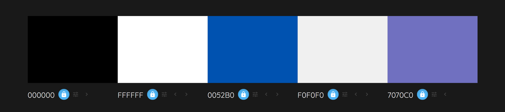
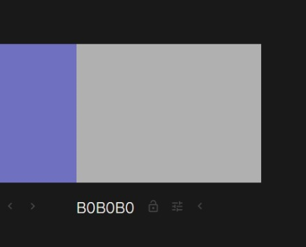
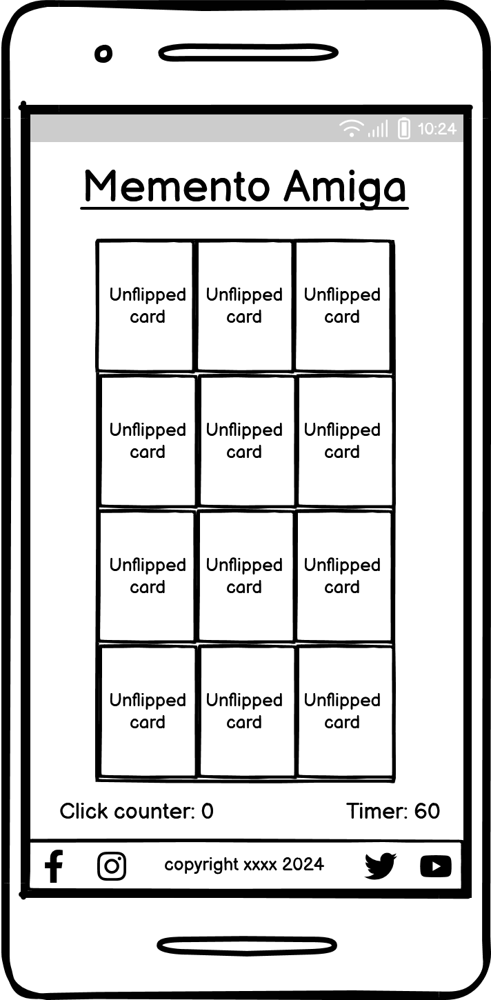
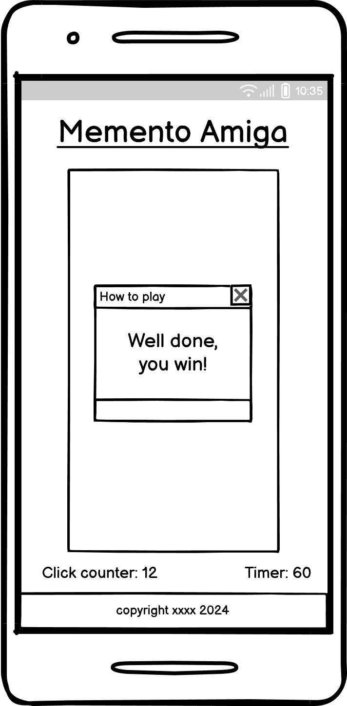
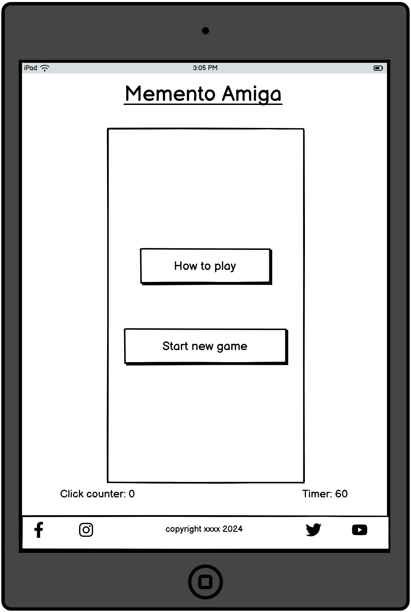
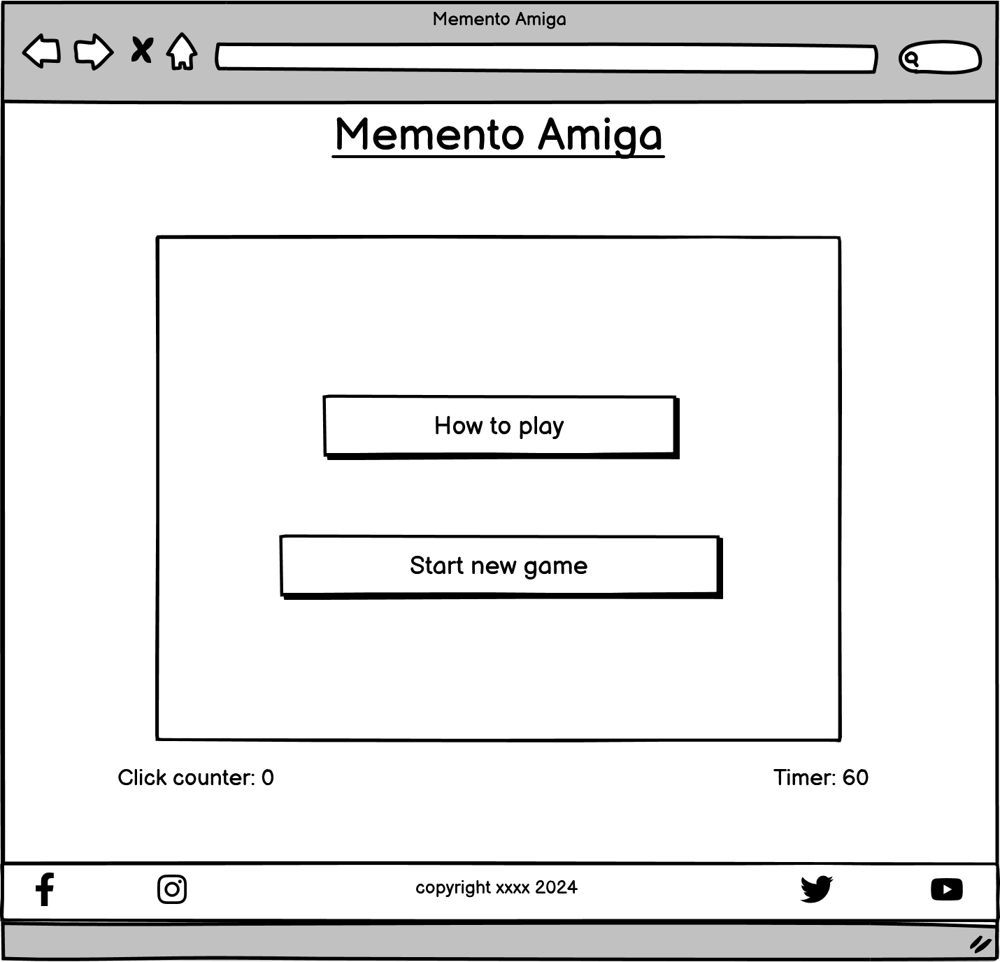
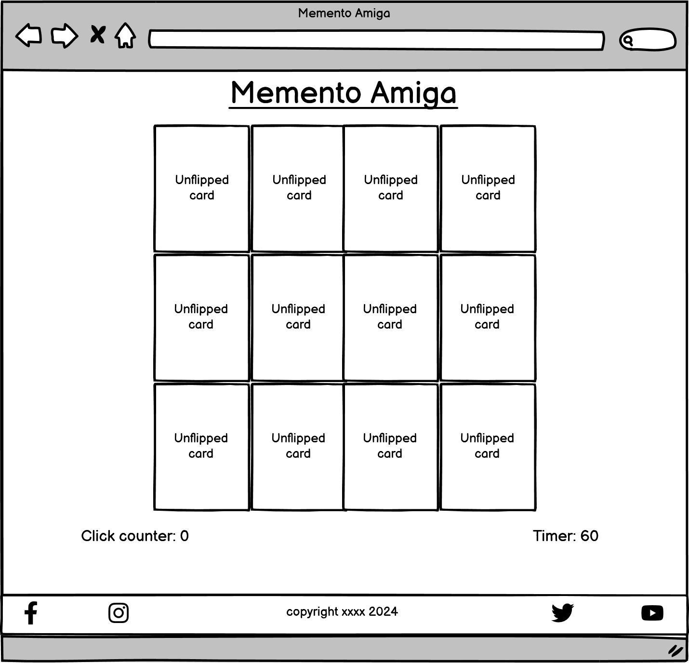
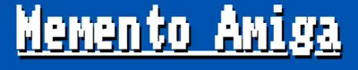

# Memento Amiga

(Developer: Gianluca Zimmatore)

## Introduction ##
**Memento Amiga** is an online classic memory card game Amiga 500 themed. The cards (both backfaces and frontfaces), as well as the general look, are inspired by the famous Amiga 500 console. In particular, frontaces are real Amiga 500 videogame covers.

[Live webpage](https://gianlooca.github.io/mementoamiga/)
 
 
 

## Table of Content

1. [Project Goals](#project-goals)
    1. [User Goals](#user-goals)
    2. [Site Owner Goals](#site-owner-goals)
2. [User Experience](#user-experience)
    1. [Target Audience](#target-audience)
    2. [User Requirements and Expectations](#user-requirements-and-expectations)
    3. [User Stories](#user-stories)
        1. [Users](#users)
        3. [Site Owner](#site-owner)
3. [Design](#design)
    1. [Design Choices](#design-choices)
    2. [Colour](#colours)
    3. [Fonts](#fonts)
    4. [Structure](#structure)
    5. [Wireframes and Game Logic General Idea](#wireframes-and-game-logic-general-idea)
        1. [Smartphone Version](#smartphone-version)
        2. [Tablet Version](#tablet-version)
        3. [Desktop Version](#desktop-version)
4. [Technologies Used](#technologies-used)
    1. [Languages](#languages)
    2. [Frameworks & Tools](#frameworks-&-tools)
5. [Features](#features)
    1. [Logo](#logo)
    2. [Central Div](#central-div)

## Project Goals 

### User Goals
- Finding a classic, fully working, memory card game with a specific theme.
- Reminiscing good old memories about childhood videogames. 
- Finding easily and intuitively all the information about the game, for those who still don't know how to play.

### Site Owner Goals
- Providing a good UX/UI.
- Giving the user an idea of how 80s computer interfaces looked.
- Providing a fully working videogame.
- Providing essential information about the business to customers.
 
 
 

## User Experience

### Target Audience
- Amiga 500 and, in general, vintage videogame enthusiasts.
- Vintage videogames enthusiasts who want to introduce their children/nephews/grandchildren to old videogames world.
- People who want to play a classic yet different memory game.

### User Requirements and Expectations
- A simple, smart and intuitive navigation system.
- Links and functions that work as expected.
- A visually appealing and responsive website.
- All the information needed to contact the game developer.
- A good level of accessibility.

### User Stories

#### Users 
1. As a user, I want to know quickly what the website is about.
2. As a user, I want to easily understand how to navigate the website.
3. As a user, I want to easily understand how to play.
4. As a user, I want to know in how many clicks/taps I won.
5. As a user, I want to see how much time it took to win.
6. As a user, I want to be able to play again easily if I lose a game.

#### Site Owner 
1. As the site owner, I want users to understand swiftly what the game is about.
2. As the site owner, I want the users to swiftly understand how to navigate the website and (re)play the game.
3. As the site owner, I want the users to enjoy a general retro look.
4. As the site owner, I want to give the user an "extra feeling" with retro videogame sounds in case of victory/defeat.
 
 
 

## Design

### Design Choices
The website has been designed choosing a minimal style, similar to the one of old Amiga 500 console template. Everything has been reduced to the bone, to give the taste of how the user interface looked (at least, in the developer's memory, at those times more interested in the actual videogames rather than in the other functionalities of the computer, whose "atmosphere" is still kind of clear).

### Colour
The colours used have been taken directly from several images of the actual Amiga 500 screen I have found on the internet, by using the DevTool eyedropper (or color picker) tool. I discarded only the orangish colour because I didn't find it useful, due to the frugal contents of the website; plus, I thought that it could have given contrast problems for vision impaired users.
I used [Colormind](http://colormind.io/) to represent the main colours used (excluding the ones from the videogames covers, too variegated to be summarized in a colour palette). A part from the general ones, used in the body, in the fonts and in the main div, I included even those of the unflipped cards (where the "Amiga logo" is; the white is not the same white used in elsewhere in the page, and we have a different shade of blue and a grey as well). 

 
*Colours used with their hexadecimal values. They come in two different images because the [Colormind website](http://colormind.io/) only allows 5 colours in a row.*

### Fonts
I chose **Amiga Topaz** font for the whole website, because it's the actual Amiga 500 font (recreated by Patrick H. Lauke, as mentioned in more detail below in the [Credits](#credits) section). The direct source can be found [here](https://fontstruct.com/fontstructions/show/675155).

### Structure
The website is very easy to navigate, essential, cut to the bone. 
It consists of a single page where, inside a main div, all the "action" and possibilities (the actual game and the other game related [Features](#features)) are developed.
We could describe the page from top to bottom as it follows: we have a main heading with the title of the game, again a main div, and out of it a click counter and a 60 seconds timer. A minimal footer with social media links and a copyright is also present.

### Wireframes
I used [Balsamiq](https://balsamiq.com/) to sketch the wireframes of the website.

Below, a showcase of the whole amount of screens for the mobile version, and a sample for the tablet and desktop versions.

#### Smartphone Version

Homepage

How to play

Unflipped cards screen

You win screen

#### Tablet Version

Homepage

Unflipped cards screen

#### Desktop Version

Homepage

Unflipped cards screen

Since interactivity (hence the use of JavaScript) is involved, I also have created a pen-and-paper blueprint, something between a list and a diagram to underline the "logic blocks" the game should have been realized from. Talking in general, we need to manage (and possibly create functions for) several issues:
- create dinamically the card blocks through JavaScript (and manipulate the DOM);
- have random and shuffle functions for the creation of cards;
- running and starting the game from a precise click event;
- make a "growing" timer start when the user begins a new game;
- calculate the number of clicks/taps (or attempts, in order to see how many of them were needed for the player to win);
- have a "flip cards" function (that also allow a maximum of two flips for each attempt);
- have a "match function";
- have a win message;
- in general, have a good event listeners management.

 
 
 

## Technologies Used

### Languages
- HTML
- CSS
- JavaScript

### Frameworks & Tools
- [Git](https://git-scm.com/)
- [GitHub](https://github.com/)
- [Gitpod](https://gitpod.io/)
- [Tinypng](https://tinypng.com/)
- [Free Convert](https://www.freeconvert.com/)
- [Clideo](https://clideo.com/)
- [Balsamiq](https://balsamiq.com/)
- [Colormind](http://colormind.io/)
- [Font Awsome](https://fontawesome.com/)
- [Am I Responsive?](https://ui.dev/amiresponsive)
- [Favicon](https://favicon.io/)
- [Snipping Tool](https://apps.microsoft.com/detail/9MZ95KL8MR0L?hl=en-US&gl=US)
- [Google](https://www.google.com/)
 
 
 

## Features
As already said, the page is "skinny": it consists of a single page and 7 features.

### Logo
- It shows the page title in the peculiar Amiga 500 font (recreated by Patrick H. Lauke). It's responsive but always the same, basically, in all the versions, so we're going to show just a sample from the smartphone version

**Smartphone Version**

 
 
