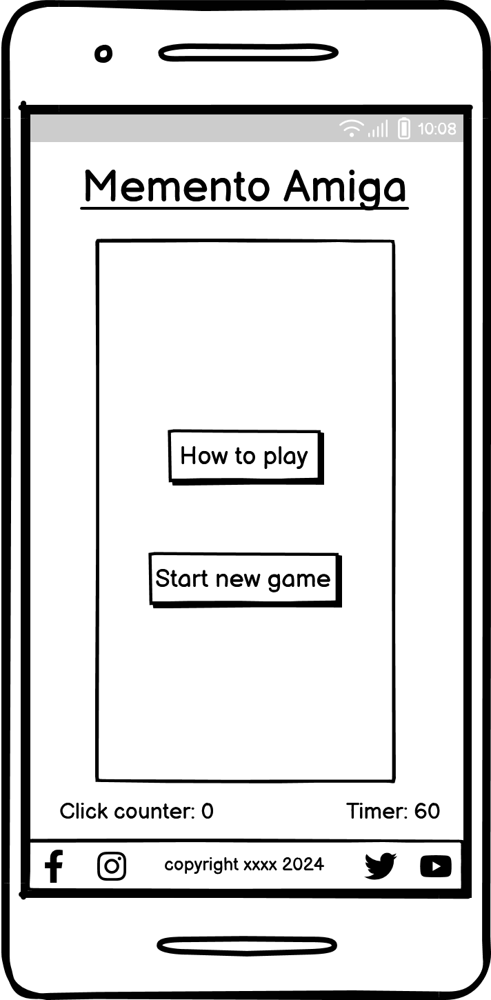
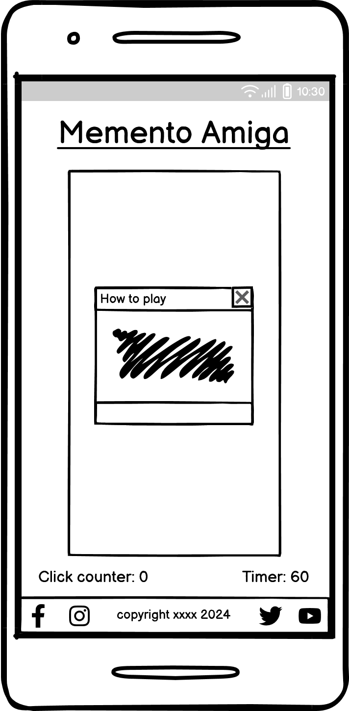
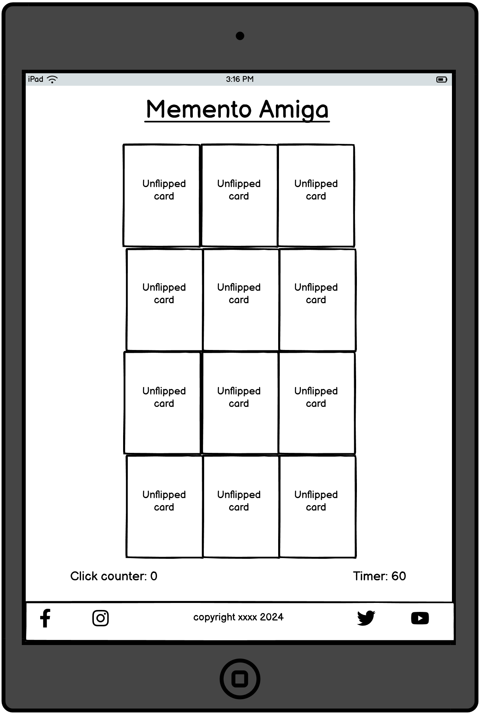
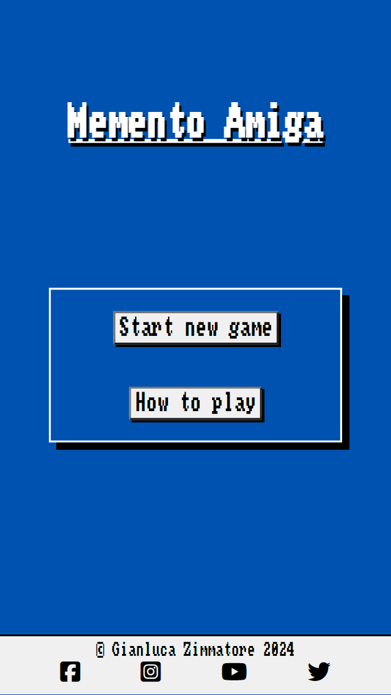

# Memento Amiga

(Developer: Gianluca Zimmatore)

## Introduction ##
**Memento Amiga** is an online classic memory card game Amiga 500 themed. The cards (both backfaces and frontfaces), as well as the general look, are inspired by the famous Amiga 500 console. In particular, frontaces are real Amiga 500 videogame covers.

[Live webpage](https://gianlooca.github.io/mementoamiga/)
 
 
 

## Table of Content

1. [Project Goals](#project-goals)
    1. [User Goals](#user-goals)
    2. [Site Owner Goals](#site-owner-goals)
2. [User Experience](#user-experience)
    1. [Target Audience](#target-audience)
    2. [User Requirements and Expectations](#user-requirements-and-expectations)
    3. [User Stories](#user-stories)
        1. [Users](#users)
        3. [Site Owner](#site-owner)
3. [Design](#design)
    1. [Design Choices](#design-choices)
    2. [Colour](#colours)
    3. [Fonts](#fonts)
    4. [Structure](#structure)
    5. [Wireframes and Game Logic General Idea](#wireframes-and-game-logic-general-idea)
        1. [Smartphone Version](#smartphone-version)
        2. [Tablet Version](#tablet-version)
        3. [Desktop Version](#desktop-version)
4. [Technologies Used](#technologies-used)
    1. [Languages](#languages)
    2. [Frameworks & Tools](#frameworks-&-tools)
5. [Features](#features)
    1. [Logo](#logo)
    2. [Central Board](#central-board)
        1. [Start New Game and How To Play Buttons](#start-new-game-and-how-to-play-buttons)
        2. [Actual Game Board](#actual-game-board)
        3. [Click Counter and Timer](#click-counter-and-timer)
        4. [Win Message](#win-message)
    3. [Footer](#footer)
6. [Testing](#validation)
    1. [HTML Validation](#HTML-validation)
    2. [CSS Validation](#CSS-validation)
    3. [JavaScript Validation](#javascript-validation)
    4. [Accessibility](#accessibility)
    5. [Lighthouse Validation](#lighthouse-validation)
    6. [Device testing](#performing-tests-on-various-devices)
    7. [Browser compatibility](#browser-compatability)
    8. [Testing user stories](#testing-user-stories)
7. [Bugs](#Bugs)
    1. [Fixed Bugs](#fixed-bugs)
    2. [Unfixed Bugs](#unfixed-bugs)
8. [Deployment](#deployment)
9. [Credits](#credits)
    1. [General References](#general-references)
    2. [Media](#media)
    3. [Code](#code)
10. [Acknowledgements](#acknowledgements)

## Project Goals 

### User Goals
- Finding a classic, fully working, memory card game with a specific theme.
- Reminiscing good old memories about childhood videogames. 
- Finding easily and intuitively all the information about the game, for those who still don't know how to play.

### Site Owner Goals
- Providing a good UX/UI.
- Giving the user an idea of how 80s computer interfaces looked.
- Providing a fully working videogame.
- Providing essential information about the business to customers.
 
 
 

## User Experience

### Target Audience
- Amiga 500 and, in general, vintage videogame enthusiasts.
- Vintage videogames enthusiasts who want to introduce their children/nephews/grandchildren to old videogames world.
- People who want to play a classic yet different memory game.

### User Requirements and Expectations
- A simple, smart and intuitive navigation system.
- Links and functions that work as expected.
- A visually appealing and responsive website.
- All the information needed to contact the game developer.
- A good level of accessibility.

### User Stories

#### Users 
1. As a user, I want to know quickly what the website is about.
2. As a user, I want to easily understand how to play.
3. As a user, I want to know in how many clicks/taps I won.
4. As a user, I want to see how much time it took to win.
5. As a user, I want to be able to play again easily.

#### Site Owner 
1. As the site owner, I want users to understand swiftly what the game is about.
2. As the site owner, I want the users to enjoy a general retro look.
3. As the site owner, I want to give the user an "extra feeling" with retro videogame sounds when the player wins.
 
 
 

## Design

### Design Choices
The website has been designed choosing a minimal style, similar to the one of old Amiga 500 console template. Everything has been reduced to the bone, to give the taste of how the user interface looked (at least, in the developer's memory, at those times more interested in the actual videogames rather than in the other functionalities of the computer, whose "atmosphere" is still kind of clear).

### Colour
The colours used have been taken directly from several images of the actual Amiga 500 screen I have found on the internet, by using the DevTool eyedropper (or color picker) tool. I discarded only the orangish colour because I didn't find it useful, due to the frugal contents of the website; plus, I thought that it could have given contrast problems for vision impaired users.
I used [Colormind](http://colormind.io/) to represent the main colours used (excluding the ones from the videogames covers, too variegated to be summarized in a colour palette). A part from the general ones, used in the body, in the fonts and in the main div, I included even those of the unflipped cards (where the "Amiga logo" is; the white is not the same white used in elsewhere in the page, and we have a different shade of blue and a grey as well). 

 
*Colours used with their hexadecimal values. They come in two different images because the [Colormind website](http://colormind.io/) only allows 5 colours in a row.*

### Fonts
I chose **Amiga Topaz** font for the whole website, because it's the actual Amiga 500 font (recreated by Patrick H. Lauke, as mentioned in more detail below in the [Credits](#credits) section). The direct source can be found [here](https://fontstruct.com/fontstructions/show/675155).

### Structure
The website is very easy to navigate, essential, cut to the bone. 
It consists of a single page where, inside a main div, all the "action" and possibilities (the actual game and the other game related [Features](#features)) are developed.
We could describe the page from top to bottom as it follows: we have a main heading with the title of the game, again a main div, and out of it a click counter and a 60 seconds timer. A minimal footer with social media links and a copyright is also present.

### Wireframes
I used [Balsamiq](https://balsamiq.com/) to sketch the wireframes of the website.

Below, a showcase of the whole amount of screens for the mobile version, and a sample for the tablet and desktop versions.

#### Smartphone Version

Homepage

How to play

Unflipped cards screen

You win screen

#### Tablet Version

Homepage

Unflipped cards screen

#### Desktop Version

Homepage

Unflipped cards screen

Since interactivity (hence the use of JavaScript) is involved, I also have created a pen-and-paper blueprint, something between a list and a diagram to underline the "logic blocks" the game should have been realized from. Talking in general, we need to manage (and possibly create functions for) several issues:
- create dinamically the card blocks through JavaScript (and manipulate the DOM);
- have random and shuffle functions for the creation of cards;
- running and starting the game from a precise click event;
- make a "growing" timer start when the user begins a new game;
- calculate the number of clicks/taps (or attempts, in order to see how many of them were needed for the player to win);
- have a "flip cards" function (that also allow a maximum of two flips for each attempt);
- have a "match function";
- have a win message;
- in general, have a good event listeners management.

 
 
 

## Technologies Used

### Languages
- HTML
- CSS
- JavaScript

### Frameworks & Tools
- [Git](https://git-scm.com/)
- [GitHub](https://github.com/)
- [Gitpod](https://gitpod.io/)
- [Tinypng](https://tinypng.com/)
- [Free Convert](https://www.freeconvert.com/)
- [Clideo](https://clideo.com/)
- [Balsamiq](https://balsamiq.com/)
- [Colormind](http://colormind.io/)
- [Font Awsome](https://fontawesome.com/)
- [Am I Responsive?](https://ui.dev/amiresponsive)
- [Favicon](https://favicon.io/)
- [Snipping Tool](https://apps.microsoft.com/detail/9MZ95KL8MR0L?hl=en-US&gl=US)
- [Google](https://www.google.com/)
- [Transfonter](https://transfonter.org/)
- [W3C CSS Validation Service - Jigsaw](https://jigsaw.w3.org/css-validator/)
- [W3C Markup Validation Service](https://validator.w3.org/)
- [JSHint](https://jshint.com/)
 
 
 

## Features
As already said, the page is "skinny": it consists of a single page and 7 features. Since, once again, the website mantains - while being responsive - pretty much the same structure on every kind of screen, we'll show just a few examples taken from different screen sizes of the mentioned features.

### Logo
- It shows the page title in the peculiar Amiga 500 font (recreated by Patrick H. Lauke). It's responsive but always the same, basically, in all the versions, so we're going to show just a sample from the smartphone version

**Smartphone Version**

 
 

### Central Board
- Everything that will happen on the website will appear inside this board, whose size will change accordingly to its content (and, again, to the screen size). It will "host", in fact:

#### Start New Game and How To Play Buttons
- The first one will evidently let the user start a new game; the second one will show the instructions.

**Smartphone (General and Detailed View) Version**

**How To Play (Once Clicked)**

#### Actual Game Board
- It has a grid of 3 columns and 4 rows of cards. You can click up to two of them per "move"; if they match, they remain flipped, otherwise they will flip back again.

**Tablet Version (With Unflipped Cards)**

**Smartphone Version (With 3 Flipped Cards)**

#### Click Counter and Timer
- In the previous screenshots it is possible to see (below the game board) a counter, to see in how many moves the player will win (to lose is not allowded in this game: you need to relax!) and a timer (again, not as a countdown... the players will take their time). These two features will start to work only when the user pushes "Start new game" and their result will be showed in the "win message" (hence, at the end of the game, their position will change: from below the Game Board to the inner part of it).

#### Win Message
- When the player will win, a win message will be displayed inside the Game Board, with the amount of moves and the time the player spent to win. A classic retro videogame sound will also "appear" (taken from the second level of the first "Rick Dangerous", to be precise) and the player will have the possibility to play a new game, by going back to the "Start New Game and How To Play" screen.

**Tablet Version**

 
 

### Footer
- it's sticky to the bottom of the page;
- it has a thin black top border to visually separate it from the main content;
- it contains the copyright information and the links to the Facebook, Instagram, YouTube and Tweeter pages of Memento Amiga, in order to give to the player the possibility of knowing more about the game developer.

**Tablet Version**

 
 
 

## Validation

### HTML Validation
The [W3C Markup Validation Service](https://validator.w3.org/) was used to validate the HTML of the website. The page has been validated (both by URI and text input) with no errors and no warnings to show. 
*Afterwards, we'll show just the link of URI validations.*

[Homepage](https://validator.w3.org/nu/?doc=https%3A%2F%2Fgianlooca.github.io%2Fmementoamiga%2F)
 

### CSS Validation
The [W3C Jigsaw CSS Validation Service](https://jigsaw.w3.org/css-validator/) was used to validate the CSS of the website.
The page has been validated by text input returning no errors but, if validated by url, with one error that can be seen [here](https://jigsaw.w3.org/css-validator/validator?uri=https%3A%2F%2Fgianlooca.github.io%2Fmementoamiga%2F&profile=css3svg&usermedium=all&warning=1&vextwarning=&lang=it#errors). It's a font-related error: previously, at the beginning of the development of Memento Amiga, I had to read [this article](https://scalablecss.com/setup-custom-fonts-with-font-face/) on Scalable CSS website in order to make the font - I do not own - work on my website. After following that tutorial, everything worked just fine: even from other devices (smartphones and laptops) the right font was displayed. Anyway, I contacted the tutor service in order to understand how to fix the error (since I know that one error here means a fail) and the tutor called Roo told me that, since we cannot access the font code (written in binary) there's probably no way to fix the error, and linked me [this article on Stack Overflow](https://stackoverflow.com/questions/6501115/lexical-error-encountered-0-after) about the same error. Anyway, he suggested me (as I will show with screenshots of the conversation) to just describe this unfixable bug here in the README.md file and, I quote him, "it will be fine". By the way, once again, the website is running, the font is displayed perfectly and the error given is lexical. I also talked with another tutor (Roman) about this, and he confirmed what Roo said. 

 

### JavaScript Validation
I used the [JSHint validator](https://jshint.com/) to test my JavaScript code. No errors or warnings have been displayed, as it can be seen on the attached image below.

JavaScript Validation

### Accessibility
The WAVE WebAIM web accessibility evaluation tool was used to ensure the website met high accessibility standards. 0 errors and 0 alerts have been displayed.

[Homepage](https://wave.webaim.org/report#/https://gianlooca.github.io/mementoamiga/)
 
 

### Lighthouse Validation
Google Lighthouse in Microsoft Edge Developer Tools was used to test performance, accessibility, best practices and SEO (Search Engine Optimization) of the website.

Homepage

 
 

### Performing tests on various devices 
The website was tested on the following devices:
- HP Laptop 15s-eq0xxx;
- Oppo A52;
- iPhone 13 Pro;
- iPhone 14 Pro
- Realme RMX3630;
- Realme 11 Pro;
- Redmi Note 11 Pro;

in addition, the website has been tested using Google Chrome DevTools (and its similar device on Microsoft Edge) for all available default device options.
 
 

### Browser compatibility
The website was tested on the following browsers:
- Google Chrome;
- Mozilla Firefox;
- Safari;
- Microsoft Egde.
 
 

### Testing User Stories

**Users**

1. As a user, I want to know quickly what the website is about.

| **Feature** | **Action** | **Expected Result** | **Actual Result** |
|-------------|------------|---------------------|-------------------|
| Central Board | Land on the Homepage, see the Central Board and read the two buttons, which makes the user understand it is surely something about a game | Understanding that the website it's about a game (an Amiga-themed memory card game in detail) | Works as expected |

Screenshots

 

2. As a user, I want to easily understand how to play.

| **Feature** | **Action** | **Expected Result** | **Actual Result** |
|-------------|------------|---------------------|-------------------|
| Central Board | Land on the Homepage, see the Central Board, click on the "how to play" button: a brief caption with instructions will show up | Understanding how to play this specific game | Works as expected |

Screenshots

 

3. As a user, As a user, I want to know in how many clicks/taps I won.

| **Feature** | **Action** | **Expected Result** | **Actual Result** |
|-------------|------------|---------------------|-------------------|
| Central Board (after a game) | Play and win a game, see the message shown at the end of it | Finding out in how many moves the game has been accomplished | Works as expected |

Screenshots

 

4. As a user, I want to see how much time it took to win.

| **Feature** | **Action** | **Expected Result** | **Actual Result** |
|-------------|------------|---------------------|-------------------|
| Central Board (after a game) | Play and win a game, see the message shown at the end of it | Finding out how much time it took to win a game | Works as expected |

Screenshots

 

5. As a user, I want to be able to play again easily.

| **Feature** | **Action** | **Expected Result** | **Actual Result** |
|-------------|------------|---------------------|-------------------|
| Central Board (after a game) | Win a game, see the message shown and click on the "Play again" button: then you'll be sent back to the Homepage where you can click again on the "Start new game" button | Starting a new game in two clicks | Works as expected |

Screenshots

 
 

**Site Owner**

1. As the site owner, I want users to understand swiftly what the game is about.

| **Feature** | **Action** | **Expected Result** | **Actual Result** |
|-------------|------------|---------------------|-------------------|
| Central Board | Land on the Homepage, see the Central Board, click on the "how to play" button: a brief caption with instructions will show up | Understanding how to play this specific game | Works as expected |

Screenshots

 

2. As the site owner, I want the users to enjoy a general retro look.

| **Feature** | **Action** | **Expected Result** | **Actual Result** |
|-------------|------------|---------------------|-------------------|
| Whole website | Land on the Homepage, see the name of the website, the general design, the fonts used, the back and the frontface of the cards | Understanding the atmosphere of the game | Works as expected |

Screenshots

 

3. As the site owner, I want to give the user an "extra feeling" with retro videogame sounds when the player wins.

| **Feature** | **Action** | **Expected Result** | **Actual Result** |
|-------------|------------|---------------------|-------------------|
| Whole website | Win a game: a typical "chip tune" (taken from the start of the third level of the Amiga 500 videogame called "Rick Dangerous") will strike up | Understanding the atmosphere of the game | Works as expected |

*Obviously it's impossible to show a sound. By the way, you can find the audio file [here](https://rickdangerous.co.uk/sounds/egypt-am.mp3).*
 
 
 

## Bugs

*Once again, numbering the amount of bugs I had to deal with - as a beginner - is impossible; this README file would double its size. I'll just mention a few of them.*

### Fixed bugs

| **Bug** | **Fix** |
| ----------- | ----------- |
| After winning a game, the Central Board (the .main-div basically) looked "sticky" to the bottom of the page, showing the footer on it | I had to create a class with the visibility property set to "hidden" (and add it dinamically with JavaScript in case of victory, on line 242) in order to maintain the .stats below the Central Board - which, as we know, is different than using the display property with a value of "none" - so the Central Board maintained its position in the page (because also of the flex property used in the .title, in the .controls and in the .stats classes) |
| I noticed that it was possible to click on a third card even after flipping the first two cards; this third card didn't flip, but the click was still counted in the statistics as a move (even if technically wasn't a move but just a click) | I created a variable (which I called stopFlip) and assigned to it a boolean value of true, but then I assigned to it a value of false after the second unmatched card of any session was flipped; until the two cards are flipped back again, no clicks are possible (and so no moves are recorded). In fact, now you always have an even number of moves in a game |
| Even if correctly uploaded in a "font" folder inside the "css" folder, the font I chose - since it is not taken from Google Fonts - wasn't working; to be precise, it wasn't displayed on devices other than my laptop (where the font is stored) | I had to follow [this tutorial on Scalable CSS](https://scalablecss.com/setup-custom-fonts-with-font-face/) - as already mentioned - and since then the font works fine everywhere. But... *I already talked about this previously and I will mention the problem again as shown below.* |

### Unfixed bugs

- Once again, even if the website works fine and the chosen font is displayed on every device I tried on (and on friends' devices), if I try to validate on the [W3C CSS Validation Service - Jigsaw](https://jigsaw.w3.org/css-validator/) by pushing the url of the website, it shows an error; and, once again, the same error isn't displayed if I validate through direct immission of the whole CSS code;
- on mobile devices, I didn't manage to stop the "win sound" that starts once the player win a game even if I exit the browser.
 
 
 

## Deployment
The website was deployed using GitHub Pages by following these steps:
1. I went to the Settings tab of my GitHub repository (created before);
2. on the left-hand sidebar, in the Code and automation section, I selected Pages;
3. made sure that "Source" was set to 'Deploy from Branch', that "Main" branch is selected and that "Folder" is set to / (root);
4. under "Branch", click "Save";
5. then I went back to the Code tab, waited a few minutes for the build to finish and refresh my repository;
6. on the right-hand side, in the "Environments" section, it has been possible to click on 'github-pages';
7. inside a frame titled "Active deployments" I saw the link of my deployed website.

You can for fork the repository by following these steps:
1. Go to the GitHub repository;
2. Click on Fork button in upper right hand corner.

You can clone the repository by following these steps:
1. Go to the GitHub repository;
2. Locate the Code button above the list of files and click it;
3. Select if you prefere to clone using HTTPS, SSH, or Github CLI and click the copy icon to copy the URL to your clipboard;
4. Open Git Bash;
5. Change the current working directory to the one where you want the cloned directory;
6. Type git clone and paste the URL from the clipboard ($ git clone https://github.com/YOUR-USERNAME/YOUR-REPOSITORY);
7. Press Enter to create your local clone.

 
 
 

## Credits

### General References

- As usual, suffice to say that [W3C website](https://www.w3.org/), [W3Schools](https://www.w3schools.com/) and [MDN Web Docs](https://developer.mozilla.org/en-US/) have been fundamental in order to get a clear (or, at least, clearer than before) sense of how to conceive and use JavaScript. I had a fundamental help also from the two following sources: the book called [A Smarter Way To Learn JavaScript](https://wccftech.com/wp-content/uploads/2014/10/JavaScript.pdf) by Mark Myers and [this other archive](https://code.mu/en/javascript/book/prime/) by Dmitry Trepachev;
- as a guide to write a complete and detailed README.md, I stick always to the work of [Ana Runje](https://github.com/4n4ru) in her [Bodelschwinger Hof Project](https://github.com/4n4ru/CI_MS1_BodelschwingherHof).
 

### Media

Images, audio files and fonts have been used by the developer for educational purposes only, and are the copyrighted property of third parties (in many cases, of no longer existing companies).

**Images**
- The famous [Amiga Floppy Disk](assets/images/amiga-floppy.webp) icon has been taken from [this website](https://www.key4biz.it/amiga-emulatore-browser/144623/) (which I don't think owns any right on it);
- the [Lemmings game cover](assets/images/lemmings.webp) has been taken from [this website](https://www.mobygames.com/game/683/lemmings/cover/group-127872/cover-351468/);
- the [Monkey Island game cover](assets/images/monkey-island.webp) has been taken from [Amazon](https://www.amazon.de/-/en/dp/B00TYNB3F0);
- the [Pang game cover](assets/images/pang.webp) has been taken from [this website](https://www.retroplace.com/it/giochi/30067--pang);
- the [Prehistorik game cover](assets/images/prehistorik.webp) has been taken from [this website](https://amiga.abime.net/games/view/prehistorik#scans);
- the [Rick Dangerous game cover](assets/images/rick-dangerous.webp) has been taken from [this website](https://www.retroplace.com/it/giochi/30556--rick-dangerous);
- [The Great Giana Sisters game cover](assets/images/The-great-giana-sisters.webp) has been taken from [this website](https://frgcb.blogspot.com/2013/09/the-great-giana-sisters-rainbow-arts.html);

**Audio**
- The only audio file has been taken from [this unofficial archive](https://rickdangerous.co.uk/sounds.htm) where other sounds from the Rick Dangerous saga can be found.

**Favicon**
- The favicon in use has been created with [Favicon](https://favicon.io/).

**Fonts**
- As mentioned above, the "Amiga Topaz" font has been re-created by Patrick H. Lauke and can be found [here](https://fontstruct.com/fontstructions/show/675155).

**Icons**
- The social media icons in the Footer have been found on [Font Awesome](https://fontawesome.com/).
 

### Code

- The biggest source of inspiration for this work comes from [this repo](https://github.com/flowforfrank/memory-game);
- a big help about the JavaScript part came also from a memory game [(here we have the link for its repo)](https://github.com/lee-joanne/memory-game) realized by the Code Institute tutor [Joanne](https://github.com/lee-joanne) to who goes my deepest thanks for having shared spontaneously with me her work;
- another help came from [this similar memory game](https://suzannenl.github.io/clouds-memory-game/) realized by the former student of the Code Institute [SuzanneNL](https://github.com/SuzanneNL);
- I have read with interest [this article](https://bobbyhadz.com/blog/javascript-hide-button-after-click) about how to make a button disapper after a click, because I needed it in my project;
- in order to create a flip card effect, I have read several articles such as [this one](https://jefferson-cuartas.medium.com/how-to-create-a-flip-card-effect-using-javascript-767dd945210c#:~:text=Firstly%2C%20in%20your%20JS%20index,which%20toggles%20on%20a%20click.) or watched tutorials (like [this interesting and beginner-friendly series](https://youtube.com/playlist?list=PLLX1I3KXZ-YH-woTgiCfONMya39-Ty8qw&si=nVuK6eb2MLpnF_RX)), but eventually I preferred to stick to the first source I mentioned in this section;
- [this other article](https://dev.to/colelevy/queryselector-vs-getelementbyid-166n#:~:text=getElementById()%20only%20works%20with,before%20returning%20the%20first%20match.) has been instructive for me, in order to understand the difference between these two JavaScript functions;
- a fundamental and quick introduction to arrow functions can be found [here](https://www.youtube.com/watch?v=fRRRkognpOs&t=415s) (and in the same YouTube channel many others instructive and easy-to-follow videos can be found);
- when I had to create a shuffle function for the cards, I also tried to get into [the famous Fisher-Yates algorithm](https://en.wikipedia.org/wiki/Fisher%E2%80%93Yates_shuffle)... without getting too much of it, but I think in some way it has been helpful;
- I needed to add a sound when a certain condition was "on"; [this other article](https://noaheakin.medium.com/adding-sound-to-your-js-web-app-f6a0ca728984#:~:text=The%20simplest%20way%20to%20add,starts%20playing%20the%20current%20audio.) about audio files in JavaScript helped me.
 
 
 

## Acknowledgements

I would like to thank:
- my JavaScript expert friend Pietro: without him, I could have never create this game;
- my mentor [Juliia Konn](https://www.linkedin.com/in/iuliia-konovalova-27948020b/) for her moral and practical support and, last but not least, her kindness;
- Code Institute Slack Community for providing practical help, support, small talk and peer reviews, in particular:
    1. [Dennis Schenkel](https://www.linkedin.com/in/dennisschenkel/), for the time spent explaining me JavaScript particulars and even checking on my progress;
    2. Krista Boka;
    3. Ellenor Vondrus;
    4. Ayisha Sandiford;
    5. Gudrun;
    6. [Stef](https://www.linkedin.com/in/stefania-frustagli-19828b156/);
- the tutors of Code Institute - once again, especially to [Rebecca](https://github.com/rebeccatraceyt) for her kindness and her efficient way to solve issues and explaining me obscure things; but special thanks also to Joanne and Roman.
